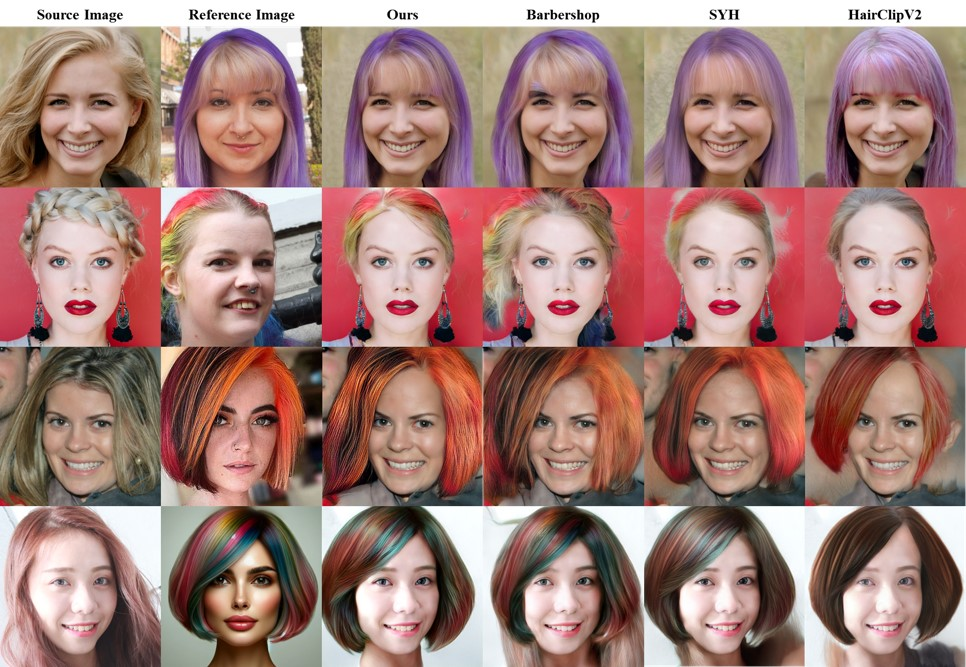
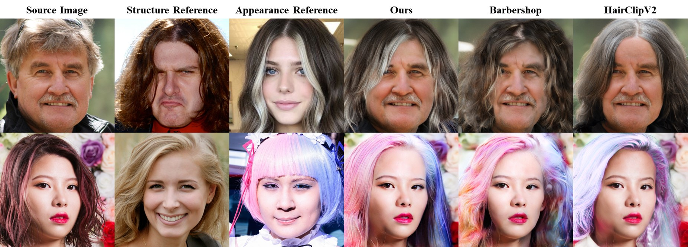
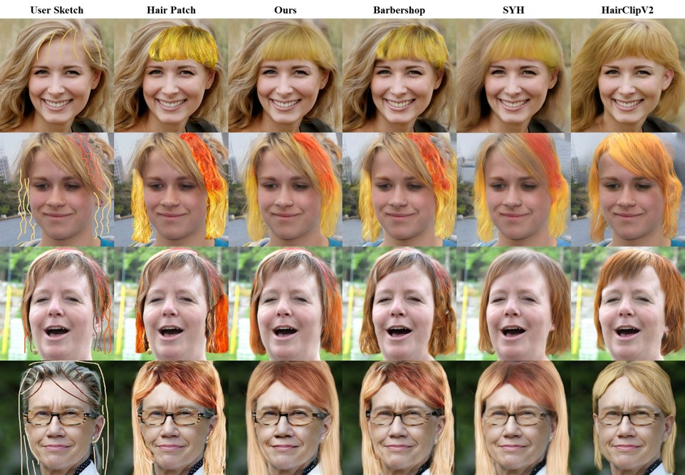

# StyleHairEdit: High-Fidelity Hair Transfer and Editing via Refined Mask Completion and Vibrant Appearance Representation
<p align="center">
  
  
  
  
</p>

> **Abstract** StyleHairEdit advances the field of realistic hairstyle manipulation through an innovative GAN-inversion approach. While recent deep generative models have made significant strides in hair editing, challenges persist in accurately reflecting user preferences and representing complex hair features. Our system addresses these issues by introducing two key improvements: refined mask completion for enhanced structure blending, and a well-designed loss function for vibrant appearance representation. The refined mask completion technique significantly improves the semantic alignment between source and reference images, enabling more natural hair transfer. Our proposed loss function, incorporating masked perceptual and style components, effectively captures and represents detailed hair features, including vivid colors and intricate strand textures. Additionally, we introduce user-controllable components that seamlessly integrate with our enhanced hair transfer process, allowing for intuitive and precise editing. Our system not only excels in hair transfer but also provides a user-friendly sketch interface for further refinement, leveraging the improved transfer capabilities. Quantitative and qualitative evaluations, including user preference studies, demonstrate that StyleHairEdit outperforms current state-of-the-art techniques in both hairstyle generation quality and usability, marking a significant advancement in GAN-based hair manipulation.

## Description
Official Implementation of "StyleHairEdit" (under review). **KEEP UPDATING! Please Git Pull the latest version.**

## Updates
`2024/06/07` All source codes have been uploaded

## Installation
- System requirement: Ubuntu22.04, Windows 11, Cuda 12.1
- Tested GPUs: RTX4090

- Dependencies:  
We recommend running this repository using [Anaconda](https://docs.anaconda.com/anaconda/install/). 
All dependencies for defining the environment are provided in `environment.yaml`.

- Create conda environment:
```
conda create -n HairTrans python=3.9
conda activate HairTrans
```

- Clone the repository:
``` 
git clone https://github.com/korfriend/VividHairStyler.git
cd VividHairStyler
```

- Install packages with `pip`:
```
pip install -r requirements.txt
```


## Download sample images
Please download the [FFHQ](https://drive.google.com/drive/folders/1RxzbNcKb3bPDKccyo300YXCJ8EvZSaIL) and put them in the `/${PROJECT_ROOT}/database/ffhq` directory.


## Getting Started  

### Prerequisites
```
$ pip install pytorch==2.1.2 torchvision==0.16.2 torchaudio==2.1.2 pytorch-cuda=12.1 -c pytorch -c nvidia
$ pip install --upgrade diffusers[torch]
```

### Download pretrained models
Clone the the pretrained models into `/${PROJECT_ROOT}/pretrained_models` directory :


| Model | Description |
| :--- | :---------- |
| [FFHQ StyleGAN](https://drive.google.com/file/d/1g8S81ZybmrF86OjvjLYJzx-wx83ZOiIw/view?usp=drive_link) | StyleGAN model pretrained on FFHQ with 1024x1024 output resolution. This includes `ffhq_PCA.npz` and `ffhq.pt`, which will be automatically downloaded. |
| [Face Parser Model (BiSeNet)](https://drive.google.com/file/d/1OG6t7q4PpHOoYNdP-ipoxuqYbfMSgPta/view?usp=drive_link) | Pretrained face parse model taken from [Barbershop](https://github.com/ZPdesu/Barbershop/). This model file is `seg.pth`, which will be automatically downloaded. |
| [Face Landmark Model](https://drive.google.com/file/d/1c-SgUUQj0X1mIl-W-_2sMboI2QS7GzfK/view?usp=drive_link) | Used to align unprocessed images. |
| [FFHQ Inversion Model](https://drive.google.com/file/d/1cUv_reLE6k3604or78EranS7XzuVMWeO/view?usp=sharing) | Pretrained image embedding model taken from [encoder4editing](https://github.com/omertov/encoder4editing). This model file is `e4e_ffhq_encode.pt`, which will be automatically downloaded. |
| [Sketch2Image Model](https://drive.google.com/file/d/1XiJbvWxzDCZaA-p1s6BWKasIMVlHcOrx/view?usp=sharing) | Pretrained sketch hair model taken from [SketchHairSalon](https://github.com/chufengxiao/SketchHairSalon/). This includes `400_net_D.pth`, `400_net_G.pth` for `S2I_braid`, `200_net_D.pth`, `200_net_G.pth` for `S2I_unbraid`, and `200_net_D.pth`, `200_net_G.pth` for `S2M`. These pretrained files need to be manually downloaded and placed in `/${PROJECT_ROOT}/pretrained_models`. |
| [HairMapper](https://github.com/oneThousand1000/HairMapper?tab=readme-ov-file#models) | Pretrained removing hair model taken from [HairMapper](https://github.com/oneThousand1000/HairMapper) (You can get it by filling out their Google form for pre-trained models access). This model file is `best_model.pt` located in the `final` folder. This pretrained file needs to be manually downloaded and placed in `/${PROJECT_ROOT}/pretrained_models`. |

### Model Organization

The pretrained models should be organized as follows:


```
./pretrained_models/
├── e4e_ffhq_encode.pt (will be downloaded when running)
├── ffhq_PCA.npz (will be downloaded when running)
├── ffhq.pt (will be downloaded when running)
├── final
│   └── best_model.pt 
├── S2I_braid
│   ├── 400_net_D.pth 
│   └── 400_net_G.pth 
├── S2I_unbraid
│   ├── 200_net_D.pth 
│   └── 200_net_G.pth 
├── S2M
│   ├── 200_net_D.pth 
│   └── 200_net_G.pth 
└── seg.pth (will be downloaded when running)
```

### Web UI

You can use the web UI by running the following command in the `/VividHairStyler` directory:
```
streamlit run VividHairStyler.py
```


## Acknowledgments
This code borrows heavily from [BARBERSHOP](https://github.com/ZPdesu/Barbershop).

