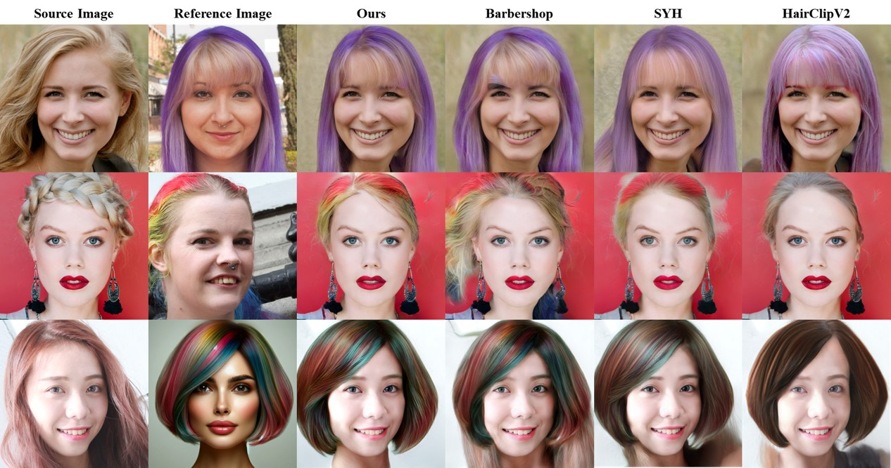
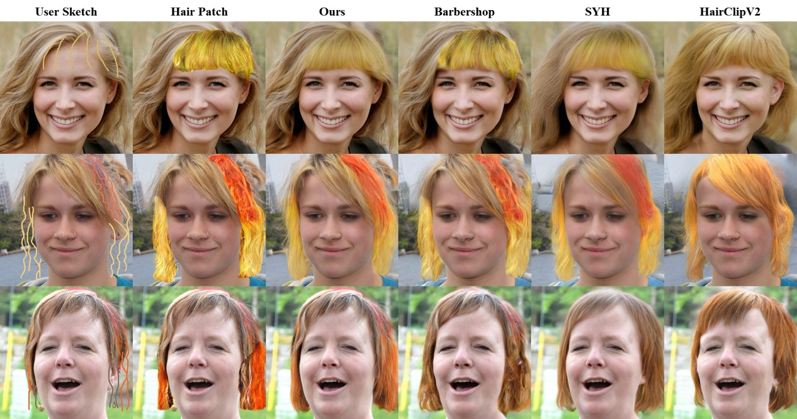

# FS Code Style Transfer: Improved Hair Transfer for Effective Sketch Hair Editing
## (new title) Improved Hairstyle Transfer: Latent Code Optimization for Vivid Hair Representation and Sketch Hair Editing
<p align="center">
  
  
  
</p>

> **Abstract** Recent advances in deep generative models have enabled realistic hairstyle editing. However, hair editing remains a challenging problem because it requires a convenient and intuitive interface that accurately reflects the user's preference, and the capability to precisely reconstruct the complex features of hair. Hair transfer, applying a hairstyle from a reference image to a source image, is widely used for its simplicity. Nevertheless, semantic misalignment and spatial feature discrepancies between the reference and source images lead to the detailed features of the reference hairstyle, such as hair color and strand texture, often not being accurately reflected in the source image. Free from this issue, sketch tools allow users to intuitively depict the desired hairstyles on specific areas of the source image, but they impose a significant design burden on users and present a technical challenge in generating natural-looking hair that seamlessly incorporates the sketch details into the source image. In this paper, we present an improved hair transfer system that utilizes latent space optimizations with masked perceptual and style losses. Our system effectively captures detailed hair features, including vibrant hair colors and strain textures, resulting in more realistic and visually compelling hair transfers. Additionally, we introduce user-controllable components used in our hair transfer process, empowering users to refine the desired hairstyle. Our sketch interfaces can efficiently manipulate these components, providing enhanced editing effects through our improved hair transfer capabilities. Quantitative and qualitative evaluations, including user preference studies, demonstrate that our hairstyle editing system outperforms current state-of-the-art techniques in both hairstyle generation quality and usability.

## Description
Official Implementation of "FS Code Style Transfer". **KEEP UPDATING! Please Git Pull the latest version.**

## Updates
`2024/06/07` All source codes have been uploaded

## Installation
- Clone the repository:
``` 
git clone https://github.com/korfriend/VividHairStyler.git
cd VividHairStyler
```
- Dependencies:  
We recommend running this repository using [Anaconda](https://docs.anaconda.com/anaconda/install/). 
All dependencies for defining the environment are provided in `environment.yaml`.

- Python environment
Alternatively, you can set up the Python environment using `pip`:
```
pip install -r requirements.txt
```

## Download sample images
Please download the [FFHQ](https://drive.google.com/drive/folders/1RxzbNcKb3bPDKccyo300YXCJ8EvZSaIL) and put them in the `/Database/ffhq` directory.


## Getting Started  

### Prerequisites
```
$ pip install torch==1.13.1+cu117 torchvision==0.14.1+cu117 torchaudio==0.13.1 --extra-index-url https://download.pytorch.org/whl/cu117

```

### Download pretrained models
Clone the the pretrained models into `/${PROJECT_ROOT}/pretrained_models` directory :

| Model | Description
| :--- | :----------
|[FFHQ StyleGAN](https://drive.google.com/file/d/1g8S81ZybmrF86OjvjLYJzx-wx83ZOiIw/view?usp=drive_link) | StyleGAN model pretrained on FFHQ with 1024x1024 output resolution.
|[Face Parse Model](https://drive.google.com/file/d/1OG6t7q4PpHOoYNdP-ipoxuqYbfMSgPta/view?usp=drive_link) | Pretrained face parse model taken from [Barbershop](https://github.com/ZPdesu/Barbershop/).
|[Face Landmark Model](https://drive.google.com/file/d/1c-SgUUQj0X1mIl-W-_2sMboI2QS7GzfK/view?usp=drive_link) | Used to align unprocessed images.
|[Image Invert Model](https://drive.google.com/file/d/1cUv_reLE6k3604or78EranS7XzuVMWeO/view?usp=sharing) | Pretrained image embedding model taken from [encoder4editing](https://github.com/omertov/encoder4editing)
|[Sketch2Image Model](https://drive.google.com/file/d/1XiJbvWxzDCZaA-p1s6BWKasIMVlHcOrx/view?usp=sharing) | Pretrained image embedding model taken from [SketchHairSalon](https://github.com/chufengxiao/SketchHairSalon/)

Finally, these pretrained models should be organized as follows:
```
./pretrained_models/
├── afhqcat_PCA.npz
├── afhqdog_PCA.npz
├── afhqwild_PCA.npz
├── e4e_ffhq_encode.pt
├── face_parsing.pth
├── ffhq_PCA.npz
├── ffhq.pt
├── final
│   └── best_model.pt
├── metfaces_PCA.npz
├── model_ir_se50.pth
├── S2I_braid
│   ├── 400_net_D.pth
│   └── 400_net_G.pth
├── S2I_unbraid
│   ├── 200_net_D.pth
│   └── 200_net_G.pth
├── S2M
│   ├── 200_net_D.pth
│   └── 200_net_G.pth
├── seg.pth
├── StyleGAN2-ada-Generator.pth
└── vgg16.pth
```

### Web UI

You can use the web UI by running the following command in the `/VividHairStyler` directory:
```
streamlit run VividHairStyler.py
```


## Acknowledgments
This code borrows heavily from [BARBERSHOP](https://github.com/ZPdesu/Barbershop).

